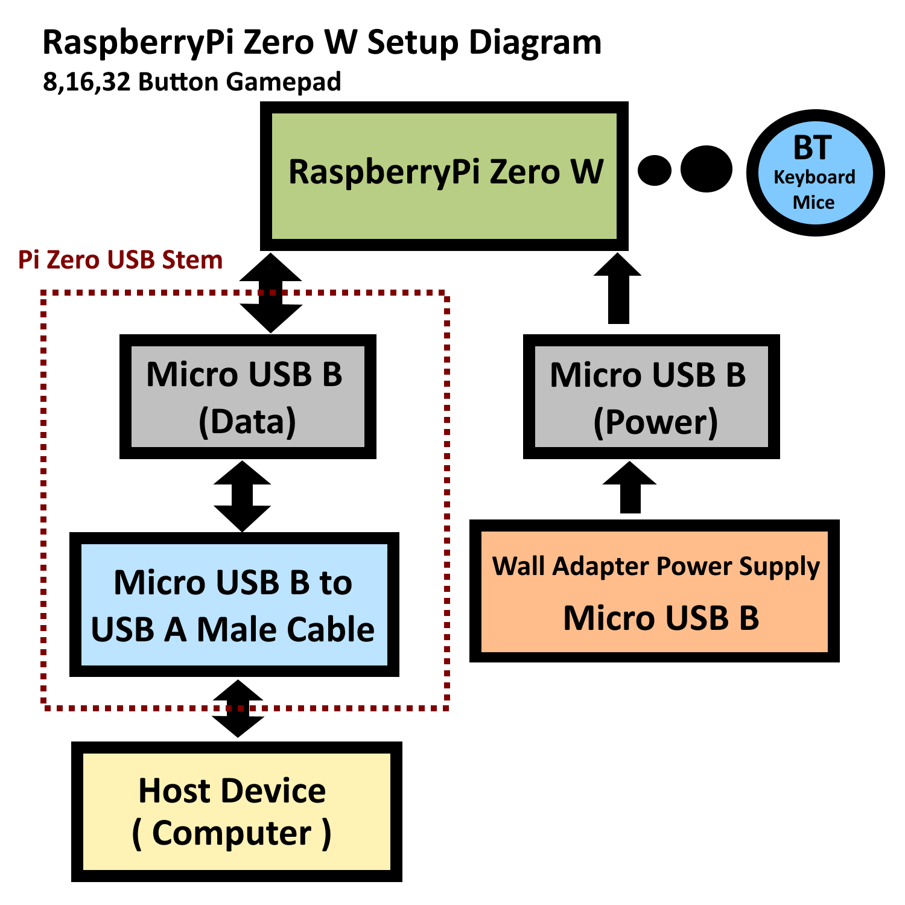
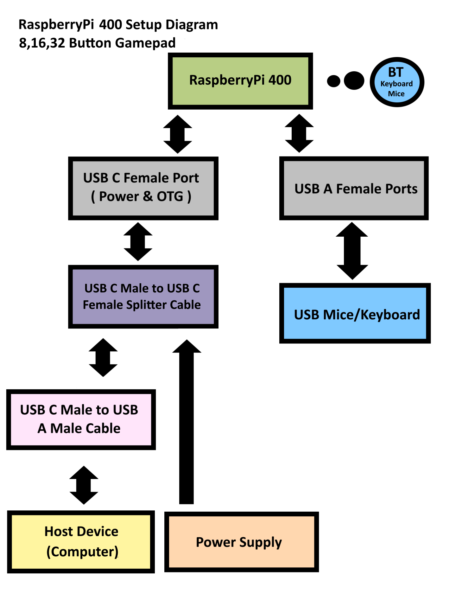

# Hardware requirements and setup 

## RaspberryPi Zero

  1. [Raspberry Pi zero W](https://www.raspberrypi.org/products/raspberry-pi-zero-w/) x 1
  2. Micro SD card x 1
  3. [Pi Zero USB Stem](https://www.sparkfun.com/products/14526) x 1
  4. OTG Micro USB B to USB A Female adapter (For USB mice/keyboard usage) x 1
  5. Micro USB B Male to USB A Male cable x 1
  6. Mice and keyboard to setup (optional)
  7. BT mice/keyboard or USB mice/keyboard as input 
  8. Power Supply
    
## RaspberryPi 4

  1. [Raspberry Pi 4B](https://www.raspberrypi.org/products/raspberry-pi-4-model-b/) x 1
  2. Micro SD card x 1
  3. [USB C Male to USB C Female Data and Power Splitter](https://www.amazon.com/Splitter-Headphone-Charger-Pixel2XL-Note20Ultra/dp/B09BBFLD22/) x 1
  4. USB C Male to USB A Male cable x 1
  5. Mice and keyboard to setup (optional)
  6. BT mice/keyboard or USB mice/keyboard as input 
  7. Power Supply
  8. XBOX Adaptive Controller
  
## RaspberryPi 400

  1. [Raspberry Pi 400](https://www.raspberrypi.org/products/raspberry-pi-400/) x 1
  2. Micro SD card x 1
  3. [USB C Male to USB C Female Data and Power Splitter](https://www.amazon.com/Splitter-Headphone-Charger-Pixel2XL-Note20Ultra/dp/B09BBFLD22/) x 1
  4. USB C Male to USB A Male cable x 1
  5. Mice and keyboard to setup (optional)
  6. BT mice/keyboard or USB mice/keyboard as input 
  7. Power Supply
  8. XBOX Adaptive Controller

# Hardware Assembly Instructions   

## RaspberryPi Zero W

### Option1 : 

  1. Solder the Pi Zero USB Stem. The main part of the assembly process is to solder the Pi Zero USB Stem to the Raspberry pi zero W. You can find the assembly instructions of Pi Zero USB Stem on [zerostem.io website](https://zerostem.io/installation/). 

  2. Insert the flashed micro SD card with the latest version of Raspbian OS into micro SD card slot.
  
  3. Connect an (OTG Micro USB B to USB A Female) adapter to the RaspberryPi Zero W through (Micro USB B) data port.
  
  4. Connect a mice and keyboard via (OTG Micro USB B to USB A Female) adapter. This step is required to install the necessary code and make Rpi act as a virtual joystick device. You can also use SSH and skip this step. 
  
  5. Connect your raspberry pi to a monitor through HDMI cable. You can also use SSH and skip this step. 

  6. Connect power supply through (Micro USB B) power port and power RaspberryPi Zero W.
  
  7. Connect RaspberryPi Zero W to your host device via Pi Zero USB Stem (USB A Male) port.
  
  
### Option2 : 
  
  1. Connect an (OTG Micro USB B to USB A Female) adapter to the RaspberryPi Zero W through (Micro USB B) data port.

  2. Insert the flashed micro SD card with the latest version of Raspbian OS into micro SD card slot.
  
  3. Connect a mice and keyboard via (OTG Micro USB B to USB A Female) adapter. This step is required to install the necessary code and make Rpi act as a virtual joystick device. You can also use SSH and skip this step. 
  
  4. Connect your raspberry pi to a monitor through HDMI cable. You can also use SSH and skip this step. 

  5. Connect power supply through (Micro USB B) port and power RaspberryPi Zero W.
  
  6. Perform the software setup and disconnect (OTG Micro USB B to USB A Female) adapter.
  
  7. Connect the (Micro USB B Male to USB A Male) cable to (Micro USB B) data port on RaspberryPi Zero W.
  
  8. Connect RaspberryPi Zero W to your host device via (Micro USB B Male to USB A Male) cable.
  
  
Note: Make sure the USB cable is connected to host device before running the codes or you may get 108 error.

  
## RaspberryPi 4 B

 
  1. Connect the (USB C Male to USB C Female Data and Power Splitter) cable to the (USB C Female) port of RaspberryPi 4 B.
  
  2. Connect the (USB C Male to USB A Male) cable to the (USB C Female) data port of (USB C Male to USB C Female Data and Power Splitter) cable.

  3. Insert the flashed micro SD card with the latest version of Raspbian OS into micro SD card slot.
  
  4. Connect a mice and keyboard via (USB A Female) ports on RaspberryPi 4 B. This step is required to install the necessary code and make Rpi act as a virtual joystick device. You can also use SSH and skip this step. 
  
  5. Connect your raspberry pi to a monitor through HDMI cable. You can also use SSH and skip this step. 

  6. Connect power supply to the (USB C Female) power port of (USB C Data and Power Splitter) cable.
  
  7. Perform the software setup.
  
  8. Connect the other end of (USB C Male to USB A Male) cable to one of the (USB A Female) ports of your Computer/XAC. 
  
  9. Connect XAC to your XBOX or Computer via (USB C Male to USB A Male) cable. This step can be skipped if you are not using XAC.

  
Note: Make sure the USB cable is connected to XAC before running the codes or you may get 108 error.

## RaspberryPi 400

 
  1. Connect the (USB C Male to USB C Female Data and Power Splitter) cable to the (USB C Female) port of RaspberryPi 400.
  
  2. Connect the (USB C Male to USB A Male) cable to the (USB C Female) data port of (USB C Male to USB C Female Data and Power Splitter) cable.
  
  3. Insert the flashed micro SD card with the latest version of Raspbian OS into micro SD card slot.
  
  4. Connect a mice and keyboard via (USB A Female) ports on RaspberryPi 400. This step is required to install the necessary code and make Rpi act as a virtual joystick device. You can also use SSH and skip this step. 
  
  5. Connect your raspberry pi to a monitor through HDMI cable. You can also use SSH and skip this step. 

  6. Connect power supply to the (USB C Female) power port of (USB C Data and Power Splitter) cable.
  
  7. Perform the software setup.
  
  8. Connect the other end of (USB C Male to USB A Male) cable to one of the (USB A Female) ports of your Computer/XAC. 
  
  9. Connect XAC to your XBOX or Computer via (USB C Male to USB A Male) cable. This step can be skipped if you are not using XAC.

  
Note: Make sure the USB cable is connected to XAC running the codes or you may get 108 error.
  
  
