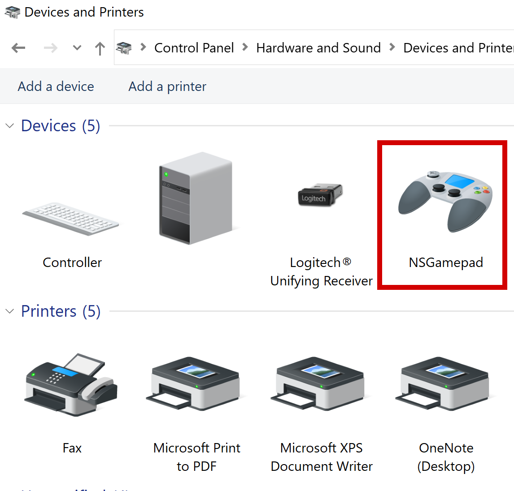

# USB Gadget NSGamepad Installation Instructions 

# Hardware requirements  

## RaspberryPi Zero

  1. [Raspberry Pi zero W](https://www.raspberrypi.org/products/raspberry-pi-zero-w/) x 1
  2. Micro SD card x 1
  3. [USB Female to Dual USB Male Extra Power Data Y Extension Cable](https://www.amazon.com/Black-Female-Extension-Mobile-CableCC/dp/B00ZUE6PVE/) x 1
  4. [Pi Zero USB Stem](https://www.sparkfun.com/products/14526) x 1
  5. OTG Micro USB B to USB A Female adapter (For USB mice/keyboard usage) x 1
  6. Micro USB B Male to USB A Male cable x 1
  7. Mice and keyboard for setup (optional)
  8. BT mice/keyboard or USB mice/keyboard as input 
  9. Power Supply
  10. [Mayflash Magic NS](https://www.amazon.com/Mayflash-Magic-NS-Wireless-Controller-Nintendo/dp/B079B5KHWQ) x 1
    
## RaspberryPi 4 B

  1. [Raspberry Pi 4B](https://www.raspberrypi.org/products/raspberry-pi-4-model-b/) x 1
  2. Micro SD card x 1
  3. [USB Female to Dual USB Male Extra Power Data Y Extension Cable](https://www.amazon.com/Black-Female-Extension-Mobile-CableCC/dp/B00ZUE6PVE/) x 1
  4. Micro USB C Male to USB A Male cable x 1
  5. Mice and keyboard to setup (optional)
  6. BT mice/keyboard or USB mice/keyboard as input 
  7. USB C Power Supply
  8. [Mayflash Magic NS](https://www.amazon.com/Mayflash-Magic-NS-Wireless-Controller-Nintendo/dp/B079B5KHWQ) x 1
  9. Micro USB C Male to USB A Female cable x 1 ( It's provided in the Mayflash box)

## RaspberryPi 400

  1. [Raspberry Pi 400](https://www.raspberrypi.org/products/raspberry-pi-400/) x 1
  2. Micro SD card x 1
  3. [USB Female to Dual USB Male Extra Power Data Y Extension Cable](https://www.amazon.com/Black-Female-Extension-Mobile-CableCC/dp/B00ZUE6PVE/) x 1
  4. Micro USB C Male to USB A Male cable x 1
  5. Mice for setup (optional)
  6. BT mice/keyboard or USB mice/keyboard as input 
  7. USB C Power Supply
  8. [Mayflash Magic NS](https://www.amazon.com/Mayflash-Magic-NS-Wireless-Controller-Nintendo/dp/B079B5KHWQ) x 1
  9. Micro USB C Male to USB A Female cable x 1 ( It's provided in the Mayflash box)


# Hardware Assembly Instructions   

## RaspberryPi Zero W


The photo shows a bare mininum configuration with Pi Zero W, USB micro cable, Mayflash adapter, and Nintendo Switch in docking station.
The docking station is powered by a wall adapter. The small HDMI monitor also has its own wall adapter.
No soldering is required.

For now, the GUI desktop is required to BT pair and connect.
The easiest way to do this is to install VNC server on the Pi, configure WiFi,
and install RealVNC VNC Viewer on Windows or Mac.

https://www.raspberrypi.org/documentation/remote-access/vnc/

<p align="center">

</p>

### Option1 : 

  1. Solder the Pi Zero USB Stem . The main part of the assembly process is to solder the Pi Zero USB Stem to the Raspberry pi zero W. You can find the assembly instructions of Pi Zero USB Stem on [zerostem.io website](https://zerostem.io/installation/). 

  2. Insert the flashed micro SD card with the latest version of Raspbian OS into micro SD card slot.
  
  3. Connect an (OTG Micro USB B to USB A Female) adapter to the RaspberryPi Zero W through (Micro USB B) data port.
  
  4. Connect a mice and keyboard via (OTG Micro USB B to USB A Female) adapter. This step is required to install the necessary code and make Rpi act as a virtual joystick device. You can also use SSH and skip this step. 
  
  5. Connect your raspberry pi to a monitor through HDMI cable. You can also use SSH and skip this step. 
  
  6. Connect power supply through (Micro USB B) power port and power RaspberryPi Zero W.
  
  7. Perform the software setup.
  
  8. Disconnect (OTG Micro USB B to USB A Female) adapter and connect power supply through (Micro USB B) power port.
  
  9. Connect RaspberryPi Zero W to your Mayflash Magic NS via connecting Pi Zero USB Stem (USB A Male) port to (USB A Female) port of Mayflash Magic NS. 
  
  10. Connect the (USB A Female to Dual USB Male Extra Power Data Y Extension) Cable to (USB A Male) port of Mayflash Magic NS. 
  
  11. Connect the power (USB A Male) port of the (USB A Female to Dual USB Male Extra Power Data Y Extension) Cable to power source.
  
  12. Connect the data (USB A Male) port of the (USB A Female to Dual USB Male Extra Power Data Y Extension) Cable to your Nintendo Switch.
  
  13. Press and hold the Mode button on Mayflash Magic NS to select NS mode. The LED should turn Red for Nintendo Switch. 

  
### Option2 : 
  
  1. Connect the (OTG Micro USB B to USB A Female) adapter to the RaspberryPi Zero W through (Micro USB B) data port.

  2. Insert the flashed micro SD card with the latest version of Raspbian OS into micro SD card slot.
  
  3. Connect a mice and keyboard via (OTG Micro USB B to USB A Female) adapter. This step is required to install the necessary code and make Rpi act as a virtual joystick device. You can also use SSH and skip this step. 
  
  4. Connect your raspberry pi to a monitor through HDMI cable. You can also use SSH and skip this step. 
  
  5. Connect power supply through (Micro USB B) power port and power RaspberryPi Zero W.
  
  6. Perform the software setup.
  
  7. Disconnect (OTG Micro USB B to USB A Female) adapter and connect power supply through (Micro USB B) power port.
  
  8. Connect the (Micro USB B Male to USB A Male) cable to (Micro USB B) data port on RaspberryPi Zero W.
  
  9. Connect the (Micro USB B Male to USB A Male) cable to (USB A Female) port of Mayflash Magic NS. 
  
  10. Connect the (USB A Female to Dual USB Male Extra Power Data Y Extension) Cable to (USB A Male) port of Mayflash Magic NS. 
  
  11. Connect the power (USB A Male) port of the (USB A Female to Dual USB Male Extra Power Data Y Extension) Cable to power source.
  
  12. Connect the data (USB A Male) port of the (USB A Female to Dual USB Male Extra Power Data Y Extension) Cable to your Nintendo Switch.
  
  13. Press and hold the Mode button on Mayflash Magic NS to select NS mode. The LED should turn Red for Nintendo Switch. 
  
Note: Make sure the USB cable is connected to host before running the codes or you may get 108 error.

  
## RaspberryPi 4 B


The photo shows a bare mininum configuration with Pi4B, USB Y cable,
Mayflash adapter, and Nintendo Switch in docking station. The Y cable is
required to draw power from both USB ports on the Switch dock. One USB port
does not provide enough current for the 4B. The docking station is powered by a
wall adapter. The small HDMI monitor also has its own wall adapter. No
soldering is required.

For now, the GUI desktop is required to BT pair and connect.
The easiest way to do this is to install VNC server on the Pi, configure WiFi,
and install RealVNC VNC Viewer on Windows or Mac.

Alternatively, access the Pi desktop GUI by connecting a monitor to the Pi HDMI
port then connect a USB keyboard and mouse.

https://www.raspberrypi.org/documentation/remote-access/vnc/

<p align="center">

</p>
 
  1. Connect the (USB C Male to USB C Female Data and Power Splitter) cable to the (USB C Female) port of RaspberryPi 4 B.
  
  2. Connect the (USB C Male to USB A Male) cable to the (USB C Female) data port of (USB C Male to USB C Female Data and Power Splitter) cable.

  3. Insert the flashed micro SD card with the latest version of Raspbian OS into micro SD card slot.
  
  4. Connect a mice and keyboard via (USB A Female) ports on RaspberryPi 4 B. This step is required to install the necessary code and make Rpi act as a virtual joystick device. You can also use SSH and skip this step. 
  
  5. Connect your raspberry pi to a monitor through HDMI cable. You can also use SSH and skip this step. 
  
  6. Connect power supply through (USB C) power port of the (USB C Male to USB C Female Data and Power Splitter) cable.  
  
  7. Perform the software setup.
  
  8. Connect the other end of (USB C Male to USB A Male) to (USB A Female) port of Mayflash Magic NS.  
      
  9. Connect the (USB C Male) port of the (USB C Male to USB A Female) cable to your Nintendo Switch.
  
  10. Press and hold the Mode button on Mayflash Magic NS to select NS mode. The LED should turn Red for Nintendo Switch. 
  
  
  
  
Note: Make sure the USB cable is connected to host before running the codes or you may get 108 error.

## RaspberryPi 400
  


The configuration for the Pi 400 is nearly identical except for the
substitution of the Pi 4B with the Pi 400.

<p align="center">

</p>
 
  1. Connect the (USB C Male to USB C Female Data and Power Splitter) cable to the (USB C Female) port of RaspberryPi 400.
  
  2. Connect the (USB C Male to USB A Male) cable to the (USB C Female) data port of (USB C Male to USB C Female Data and Power Splitter) cable.

  3. Insert the flashed micro SD card with the latest version of Raspbian OS into micro SD card slot.
  
  4. Connect a mice and keyboard via (USB A Female) ports on RaspberryPi 4 B. This step is required to install the necessary code and make Rpi act as a virtual joystick device. You can also use SSH and skip this step. 
  
  5. Connect your raspberry pi to a monitor through HDMI cable. You can also use SSH and skip this step. 
  
  6. Connect power supply through (USB C) power port of the (USB C Male to USB C Female Data and Power Splitter) cable.  
  
  7. Perform the software setup.
  
  8. Connect the other end of (USB C Male to USB A Male) to (USB A Female) port of Mayflash Magic NS.  
      
  9. Connect the (USB C Male) port of the (USB C Male to USB A Female) cable to your Nintendo Switch.
  
  10. Press and hold the Mode button on Mayflash Magic NS to select NS mode. The LED should turn Red for Nintendo Switch. 

  
Note: Make sure the USB cable is connected to host device before running the codes or you may get 108 error.


# Software requirements  

  1. Install latest version of Raspbian OS on an SD card according to the official documents on [raspberrypi.org](https://www.raspberrypi.org/documentation/installation/installing-images/).
  
 # Software installation 
 
1.	Download Dependencies

  1.1. Startup the raspberrypi
  
  1.2. Open the command line
  
  1.3. Install the necessary packages
```
sudo apt-get update
sudo apt-get install build-essential python-dev python-pip git
```

2.	Set up USB gadget mode

  2.1. Download source code and necessary scripts
  
```
git clone https://github.com/milador/RaspberryPi-Joystick
cd RaspberryPi-Joystick/NSGamepad
```

  3.2. Enable libcomposite and other necessary modules and drivers

```
sudo echo "dtoverlay=dwc2" | sudo tee -a /boot/config.txt
sudo echo "dwc2" | sudo tee -a /etc/modules
sudo echo "libcomposite" | sudo tee -a /etc/modules
```

3.	Create the virtual joystick HID config script

```
sudo touch /usr/bin/ns_gamepad_usb
sudo chmod +x /usr/bin/ns_gamepad_usb
```

4.	Add virtual joystick HID config script to startup scripts and run it automatically after OS boot

  4.1. Open /etc/rc.local
  
```
sudo nano /etc/rc.local
```
  4.2. Add following command on the line above "exit 0" and save it. ( Add it on the line before "exit 0" )
  
```
/usr/bin/ns_gamepad_usb # Raspberry NSGamepad joystick libcomposite configuration
```

5.	Create the NS Gamepad HID gadget 

```
sudo chmod +x ns_gamepad_usb
sudo cp ns_gamepad_usb /usr/bin/
```

The report descriptor is created to define a generic gamepad with 2 sticks, 1 dpad, and 14 buttons HID device. The report descriptor used in the ns_gamepad_usb gadget definition is presented in hexadecimal values as follows:

```
05010905a10115002501350045017501950e05091901290e81029502810105012507463b017504950165140939814265009501810126ff0046ff000930093109320935750895048102750895018101c0
```

The actual USB Report Descriptor can be defined as following:

```
0x05, 0x01,        // Usage Page (Generic Desktop Ctrls)
0x09, 0x05,        // Usage (Game Pad)
0xA1, 0x01,        // Collection (Application)
0x15, 0x00,        //   Logical Minimum (0)
0x25, 0x01,        //   Logical Maximum (1)
0x35, 0x00,        //   Physical Minimum (0)
0x45, 0x01,        //   Physical Maximum (1)
0x75, 0x01,        //   Report Size (1)
0x95, 0x0E,        //   Report Count (14)
0x05, 0x09,        //   Usage Page (Button)
0x19, 0x01,        //   Usage Minimum (0x01)
0x29, 0x0E,        //   Usage Maximum (0x0E)
0x81, 0x02,        //   Input (Data,Var,Abs,No Wrap,Linear,Preferred State,No Null Position)
0x95, 0x02,        //   Report Count (2)
0x81, 0x01,        //   Input (Const,Array,Abs,No Wrap,Linear,Preferred State,No Null Position)
0x05, 0x01,        //   Usage Page (Generic Desktop Ctrls)
0x25, 0x07,        //   Logical Maximum (7)
0x46, 0x3B, 0x01,  //   Physical Maximum (315)
0x75, 0x04,        //   Report Size (4)
0x95, 0x01,        //   Report Count (1)
0x65, 0x14,        //   Unit (System: English Rotation, Length: Centimeter)
0x09, 0x39,        //   Usage (Hat switch)
0x81, 0x42,        //   Input (Data,Var,Abs,No Wrap,Linear,Preferred State,Null State)
0x65, 0x00,        //   Unit (None)
0x95, 0x01,        //   Report Count (1)
0x81, 0x01,        //   Input (Const,Array,Abs,No Wrap,Linear,Preferred State,No Null Position)
0x26, 0xFF, 0x00,  //   Logical Maximum (255)
0x46, 0xFF, 0x00,  //   Physical Maximum (255)
0x09, 0x30,        //   Usage (X)
0x09, 0x31,        //   Usage (Y)
0x09, 0x32,        //   Usage (Z)
0x09, 0x35,        //   Usage (Rz)
0x75, 0x08,        //   Report Size (8)
0x95, 0x04,        //   Report Count (4)
0x81, 0x02,        //   Input (Data,Var,Abs,No Wrap,Linear,Preferred State,No Null Position)
0x75, 0x08,        //   Report Size (8)
0x95, 0x01,        //   Report Count (1)
0x81, 0x01,        //   Input (Const,Array,Abs,No Wrap,Linear,Preferred State,No Null Position)
0xC0,              // End Collection

// 80 bytes
```

6. Save and reboot the Rpi zero:
  
```
sudo reboot
```
  
7. Connect your Rpi zero to your computer and make sure it recognizes your Rpi zero as a USB HID joystick device named "RaspberryPi Joystick". Wait at least 30 seconds for Raspberry Pi to emulate as a HID Joystick device. Windows will initially say the USB Device is not recognized but detects it as a joystick in 30 seconds. 

  
8.  Startup your Rpi zero and enter following commands to test the configuration:
   
```
sudo /usr/bin/ns_gamepad_usb
ls -la /dev/hidg*
```   

You should get something similar to following which means it's working and ready to use.

```
crw------- 1 root root 243, 0 Dec 26 02:34 /dev/hidg0
```   

9.  Windows 10 detects Raspberry Pi joystick as a USB HID device and you can use find it under Control Panel\Hardware and Sound\Devices and Printers.

<p align="center">

</p>

<p align="center">

</p>

# Data packets

The data sent to the host device for the 14 buttons , 1 dpad, and dual axis joystick configuration of the joystick contains 6 bytes, 2 are for the XY and 4 are the buttons. 

# Testing

1.  gamepad_ns_keyboard.py: A sample code to convert keyboard actions to joystick actions using command line and a keyboard is available to test the functionality. This method has packets exposed which is not recommended for usage. 

  1.1. Change the path to Code sub-directory ( You can skip 1.2 to 1.6 )

```
cd RaspberryPi-Joystick/NSGamepad/Code
```  
  
  1.2. Download the NSGamepad keyboard input interface code: [gamepad_ns_keyboard.py](https://github.com/milador/RaspberryPi-Joystick/blob/master/NSGamepad/Code/gamepad_ns_keyboard.py)

  1.3. Create a new python file using following command:
  
```
sudo nano gamepad_ns_keyboard.py
sudo chmod +x gamepad_ns_keyboard.py
```   

  1.4. Copy and paste the gamepad_ns_keyboard.py code available under Code directory.

  1.5. Save gamepad_ns_keyboard.py file and exit
  
  1.6. Test operating RaspberryPi-Joystick using gamepad_ns_keyboard.py code with a physical keyboard or SSH
  
```
sudo python gamepad_ns_keyboard.py
```   


2.  NSGamepad.py: A class created to handle button actions,dpad and dual axis joystick actions.

3.  gamepad_ns_demo.py: A sample code that automatically press buttons and move joystick

  3.1. Change the path to Code sub-directory

  3.2. Start running the python script
  
```
sudo python gamepad_ns_demo.py
```   


# Usage Setup

Connect RaspberryPi to one of the USB ports on your host device. Make sure you use an external power source to power RaspberryPi. Wait 30 seconds for it to initialize.


## Bluetooth

1.  Pair BT keyboard/mouse using RaspberryPi GUI taskbar.

  1.1. Click on Bluetooth button icon on top right of RaspberryPi GUI taskbar.
<p align="center">

</p>

  1.2. Click on Add Device
  
  1.3. Select your BT keyboard/mouse and Click on Pair button
<p align="center">

</p>

2.  Restart RaspberryPi.

# Usage

The file ns_gamepad_usb, based on 8_buttons_joystick_usb, configures the USB OTG
port as a gamepad with 2 analog sticks, 1 dpad, and 14 buttons. Be sure to run
it as root using sudo. Or set it up to auto run from /etc/rc.local. See the
docs for 8_joystick.

```
$ cd NSGamepad
$ sudo ./ns_gamepad_usb
```

The class and test program are in Code/NSGamepad.py.

The class can be imported into another Python3 program like this.

```
from NSGamepad import *
```

To run the gamepad demo program do the following. The program presses and
releases all buttons then rotates the joysticks and dpad.

```
$ cd RaspberryPi-Joystick/NSGamepad/Code
$ sudo python3 gamepad_ns_demo.py
```

To test the gamepad_ns_inputevent python script run following command:
  
```
sudo python3 gamepad_ns_inputevent.py
```   

That's it! You should now be able to use your BT keyboard/mouse to operate as NSGamepad.
  


## Nintendo Switch
To run the gamepad keyboard program for a Nintendo Switch do the following.

```
$ cd Code
$ sudo python3 gamepad_ns_keyboard.py
```

The active keys for a Nintendo Switch are listed below

Key |Gamepad button
----|--------------
1   |A
2   |B
3   |X
4   |Y
5   |L
6   |R
7   |ZL
8   |ZR
9   |+
0   |-
W   |left stick up
A   |left stick left
S   |left stick down
D   |left stick right
P   |right stick up
L   |right stick left
;   |right stick down
'   |right stick right
Q   |quit program

To control a Nintendo Switch, use a Mayflash Magic NS adapter. Plug the
Zero into the Mayflash adapter then plug the Mayflash adapter into the Switch
dock. I suggest using the dock because the adapter and Zero may draw too much
current from the Switch battery if it is plugged directly into the Switch.
Configure the adapter to "Switch Pro" mode. The LED should be purple.

IMPORTANT: The Switch uses wireless communications even when a controller is
plugged in via USB. To change this start from the Home screen. Select
System Settings | Controllers and Sensors | Pro Controller Wired Communication.
Change it to ON.

## Playstation 4

To run the gamepad keyboard program for a Playstation 4 do the following.

```
$ cd Code
$ sudo python3 gamepad_ns_keyboard_ps4.py
```

The active keys for a Playstation 4 are listed below

Key |Gamepad button
----|--------------
1   |CIRCLE
2   |SQUARE
3   |TRIANGLE
4   |CROSS
5   |L1
6   |R1
7   |L2
8   |R2
9   |OPTIONS
0   |LOGO
W   |left stick up
A   |left stick left
S   |left stick down
D   |left stick right
P   |right stick up
L   |right stick left
;   |right stick down
'   |right stick right
Q   |quit program

To control a Playstation 4, use a Mayflash Magic S Pro adapter. This adapter
supports PS4 and Nintendo Switch. Plug the Zero into the Mayflash adapter then
plug the Mayflash adapter into the PS4. Configure the adapter to "PS4" mode.
The LED should be blue.
  
  
 # Autostart
 
 We go over process to make the gamepad_ns_inputevent.py start automatically on boot 

1.  Create ns_gamepad service
```
sudo nano /etc/systemd/system/ns_gamepad.service
```   

2.  Add following script to ns_gamepad.service and save it

```
[Unit]
Description=NS Gamepad automatic start with systemd, respawn, after bluetooth
After=bluetooth.target
After=multi-user.target
Requires=bluetooth.target

[Service]
ExecStart=/usr/bin/python3 -u gamepad_ns_inputevent.py
WorkingDirectory=/home/pi/RaspberryPi-Joystick/NSGamepad/Code
Type=idle
Restart=always
StandardOutput=syslog
StandardError=syslog
SyslogIdentifier=ns_gamepad
ExecStartPre=/bin/sleep 10
User=root
Group=root

[Install]
WantedBy=multi-user.target
```   

3.  Create a rule to give permission for execution of python code and accessing input devices 

```
sudo nano /etc/udev/rules.d/rpi_device.rules
```   

4.  Add rules to give permission for execution of python code and accessing input devices to rpi_device.rules and save it.

```
KERNEL=="hidg0", NAME="%k", GROUP="pi", MODE="0666"
KERNELS=="input*", MODE="0666" GROUP="plugdev"
```   

5.  Enable and start the ns_gamepad.service

```
systemctl daemon-reload
systemctl enable ns_gamepad.service
systemctl start ns_gamepad.service
```   
Use following to check status of running service :

```
systemctl status ns_gamepad.service
```   

6.  Perform reboot

```
sudo reboot
```   

 # Auto Connection Repair
 
Most of input HID bluetooth devices auto connect on boot if they are already paired, but there are bluetooth devices that fail to always auto connect on startup.
The following process will attempt to connect to every paired device and restart the running service: 

1.  Navigate the connection and restart repair script directory
```
cd /home/pi/RaspberryPi-Joystick/Repair
```   

Note: To manually execute the connection and restart repair script:
```
sudo sh connection_repair.sh
```   

2.  Set the permission of connection repair systemctl service
```
sudo chmod +x connection_repair.service
```   

3.  Copy connection repair systemctl service to systemd path
```
sudo cp connection_repair.service /etc/systemd/system/
```   

4.  Enable and start the connection_repair.service

```
systemctl daemon-reload
systemctl enable connection_repair.service
systemctl start connection_repair.service
```   

5.  Perform reboot

```
sudo reboot
```   
