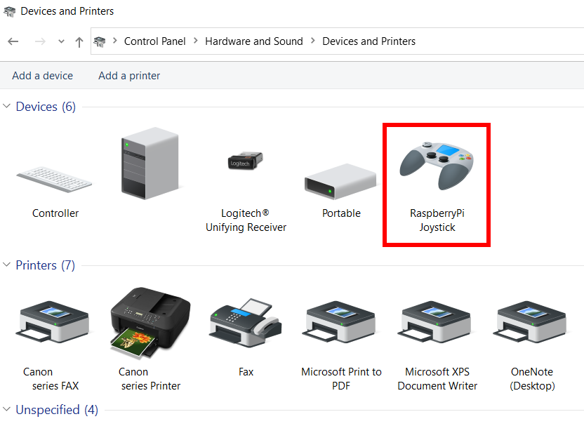

# Software requirements and setup

# Software requirements  

  1. Install latest version of Raspbian OS on an SD card according to the official documents on [raspberrypi.org](https://www.raspberrypi.org/documentation/installation/installing-images/).
  
 # Software installation 
 
1.	Download install.sh to your main /home/pi/ directory

2.	Run the shell script to install the software. You can pass an argument to define your desired configuration.

Note: The configuration for XAC Compatible Gamepad will be selected if no argument is passed.
  
```
sh install.sh
```

- 8 Button Gamepad
```
sh install.sh 8b
```

- 16 Button Gamepad
```
sh install.sh 16b
```

- 32 Button Gamepad
```
sh install.sh 32b
```

- NS Compatible Gamepad
```
sh install.sh ns
```

- XAC Compatible Gamepad
```
sh install.sh xac
```

3.  Startup your Rpi and enter following commands to test the configuration:
   
```
ls -la /dev/hidg*
```   

You should get something similar to following which means it's working and ready to use.

```
crw------- 1 root root 243, 0 Dec 26 02:34 /dev/hidg0
```   

4.  Windows 10 detects Raspberry Pi joystick as a USB HID device and you can use find it under Control Panel\Hardware and Sound\Devices and Printers.

<p align="center">

</p>


# Usage Setup

Connect RaspberryPi to one of the USB ports on your host device. Make sure you use an external power source to power RPi Zero. Wait 30 seconds for it to initialize.


## Bluetooth

1.  Pair BT keyboard/mouse using RaspberryPi GUI taskbar.

  1.1. Click on Bluetooth button icon on top right of RaspberryPi GUI taskbar.
<p align="center">

</p>

  1.2. Click on Add Device
  
  1.3. Select your BT keyboard/mouse and Click on Pair button
<p align="center">

</p>

